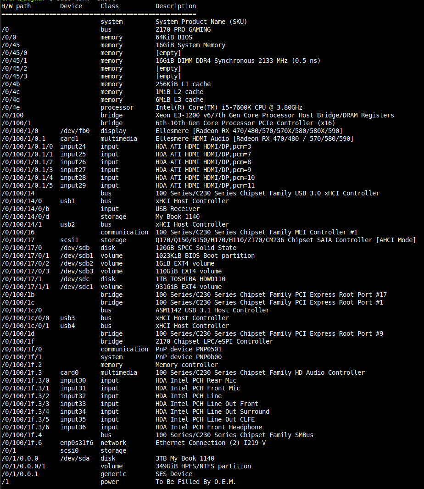
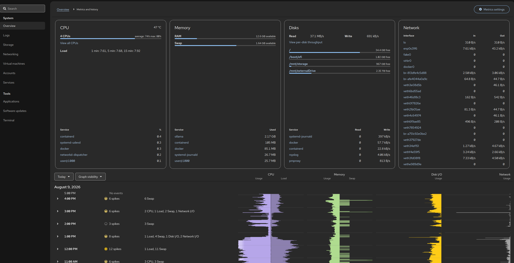
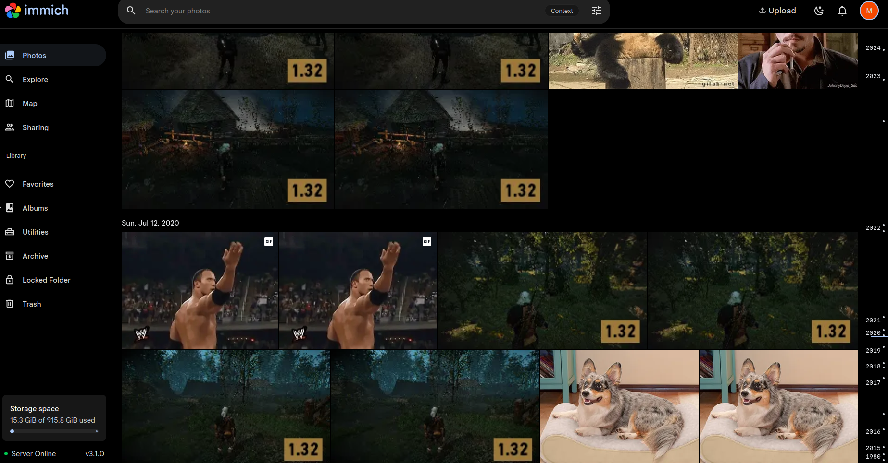
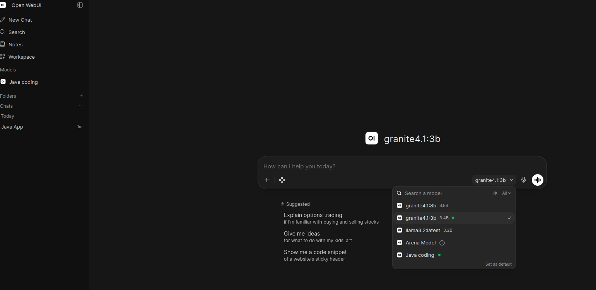
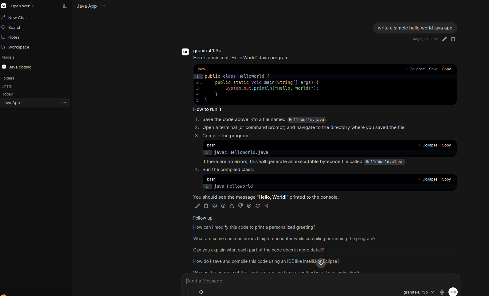

# Home Server Setup

Using an old computer bought in 2017-2018 I set up a personal home server that allows storage for personal files and the use of a basic LLM's. Due to the age of the hardware LLM models such as llama3.2 and granite4.1:3b are utilized for this. 

---

## Hardware Specifications

The system is built on an Intel/ASUS platform with dedicated AMD graphics and a mix of internal and external storage.

### Core Components

| Component | Model / Description |
| :--- | :--- |
| **Motherboard** | ASUS Z170 PRO GAMING |
| **Processor (CPU)** | Intel® Core™ i5-7600K @ 3.80GHz (6MB L3 Cache) |
| **Memory (RAM)** | 16GB DDR4 @ 2133 MHz (1x 16GB DIMM, 3 slots open) |
| **Graphics (GPU)** | AMD Radeon RX 400/500 Series (Ellesmere Architecture) |
| **Networking** | Intel I219-V Gigabit Ethernet |

### Storage 

| Drive | Capacity | Type | Mount / Format |
| :--- | :--- | :--- | :--- |
| **Silicon Power (SPCC)** | 120GB | Internal SSD | Boot Drive (EXT4) | Used specifically for boot and also running LLM and services
| **Toshiba HDWD110** | 1TB | Internal HDD | General Storage (EXT4) | Storage for documents, work files and code.
| **WD My Book 1140** | 3TB | External USB | External Backup (NTFS) | Portable storage for photos and videos.

---

## Software Stack

The server runs a lean, container-forward software stack focused on lean local AI, media backup, and development.

### Operating System
*   **[Ubuntu Server 26.04 LTS](https://ubuntu.com/server)**: The base operating system hosting the Docker daemon.

  

### Infrastructure & Management
*   **[Portainer](https://www.portainer.io/)**: A lightweight management UI for managing Docker containers, images, and networks.

### Applications & Services
*   **[Immich](https://immich.app/)**: A high-performance, self-hosted photo and video backup solution directly competing with Google Photos.
  

  
*   **[Paperless-ngx](https://docs.paperless-ngx.com/)**: A document management system that transforms physical documents into a searchable online archive.
*   **[VS Code Server](https://github.com/coder/code-server)**: Visual Studio Code running entirely on the server, accessible securely via any web browser.

### Local AI 
*   **[OpenWebUI](https://openwebui.com/)**: An extensible, feature-rich, and user-friendly WebUI for interacting with local Large Language Models.

    *   **Active Models:** 
        *   [`llama3.2`](https://ai.meta.com/llama/) (Meta)
        *   [`granite4.1:3b`](https://huggingface.co/ibm-granite) (IBM)
          *   Below an example of IBM Granite 4.1:3b creating a basic "Hello World!" Java app.
          
